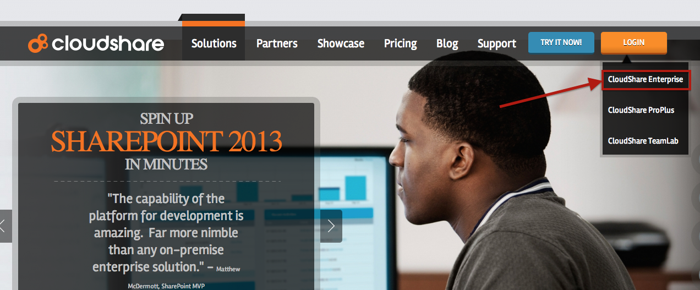
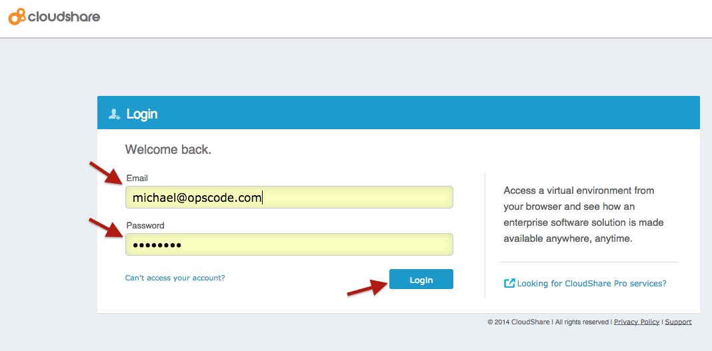
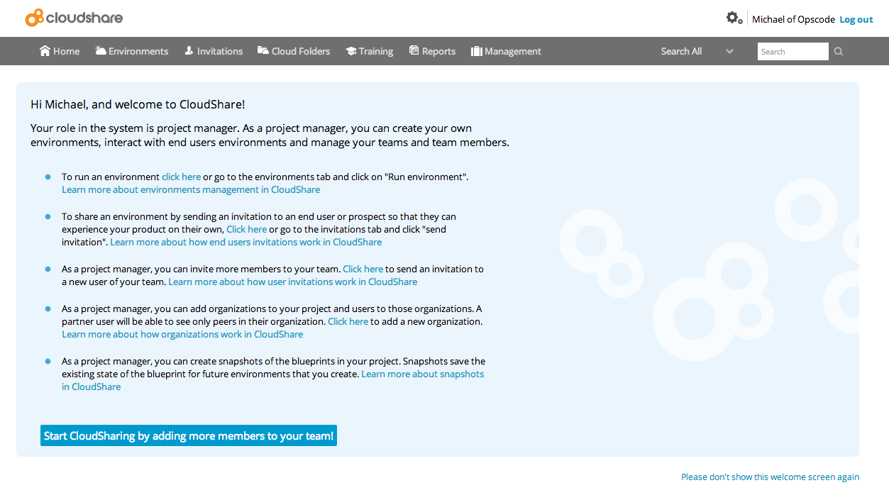
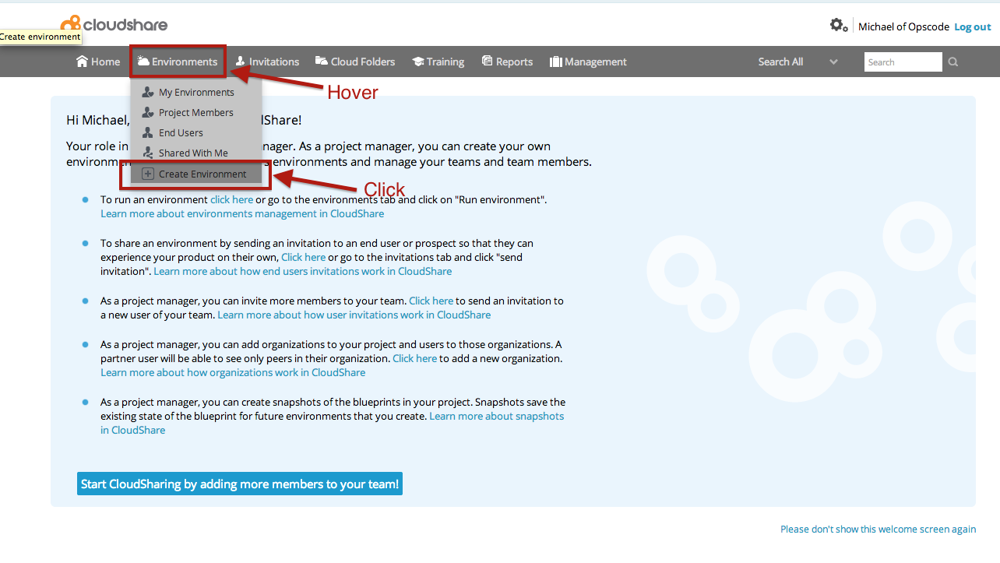
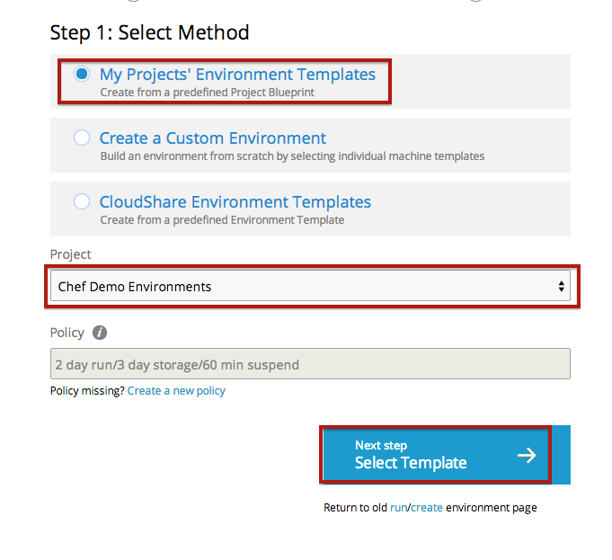
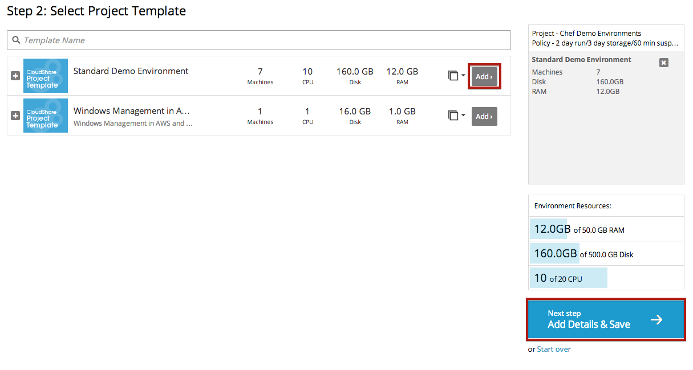
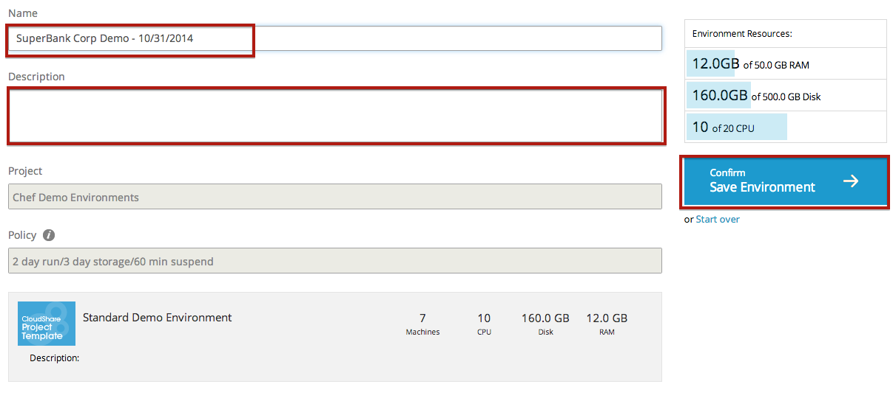
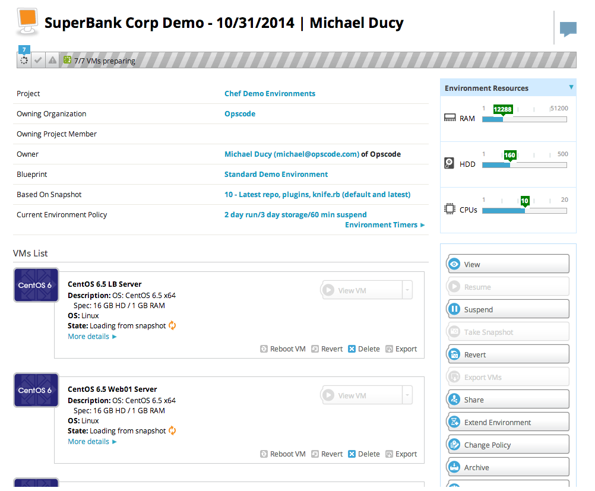

Standard Chef Demo
==================

This Demo is built to show basic Chef uses cases to introduce the user to Chef. It can be run standalone or within the CloudShare Chef environment. 

Stories
-------

The following stories are currently supported:

* Deploy Linux based Webservers with Linux based Load Balancer
* Deploy Windows based Webserver
* Deploy Linux or Windows based servers to AWS EC2, and leverage a ELB

Roles
-----

Centos:
* `base_centos` - Base content for Centos based nodes.
* `aws_webserver` - installs the `webserver` role and `apache::aws_lb` recipe to setup a server in EC2 as a webserver. Requires Centos based OS, and ELB in EC2.
* `webserver` - installs a webserver for Centos nodes. Includes Chef website as content.
* `LoadBalancer` - installs HAproxy and searches for `role:webserver` inorder to add to the LB pool.

Windows:
* `base_windows` - Base content for Windows based nodes.
* `fourthcoffee` - Install the FourthCoffee website. Can be used for DSC and non-DSC based demos.
* `nopcom` - Installs the NopCommerce ecommerce package.

Cookbooks
---------

An effort is made to pull as many cookbooks from the community site and not include them in this repo. The Berksfile has the dependent cookbooks. The custom cookbooks included in the repo are listed below:

* `apache` - Basic apache cookbook as written in the Chef Fundementals class and extended in the Chef Intermediate class.
* `lb` - borrows from the HAProxy community cookbook but removes lots of unneeded content.
* `fwrules` - Opens ports listed in the `node['fwrules']` attribute.
* `workstation` - Makes changes to the workstation in CloudShare at launch. 

CloudShare Usage
----------------

This demo can be used in a standalone environment that you provide or inside of the CloudShare Enterprise environment. 

### Launching a Demo Environment in CloudShare

1. Visit [CloudShare.com](http://cloudshare.com)
2. Click the link to login to CloudShare Enterprise

3. Enter your username, password, and click `Login`

4. You should now be logged into CloudShare and see a welcome screen.

5. Hover over `Environments` and then click `Create Environment`.

6. Select `My Projects' Environment Templates`, make sure the `Project` is `Chef Demo Environments` and then click `Select Template`

7. A list of the Project's templates will be displayed. Click `Add` next to the `Standard Demo Environment` template. Then click `Add Details & Save`

8. Give your Demo Environment a descriptive name (Optional) and description (optional), then click `Save Environment`

9. You will then see a page showing the machines in your environment. Once all the VMs are in a `Ready` state you can begin using your environment.

### Using the CloudShare Demo